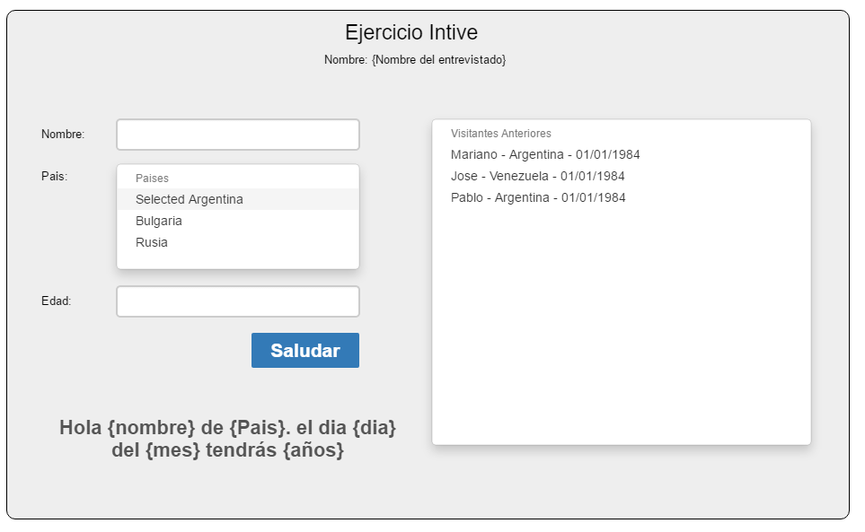

# reacttest
React Test

EJERCICIO TÉCNICO:
Crear un componente o un grupo de componentes que traigan un formulario con:

- Nombre
- Pais (sacado de un dropdown de paises)
- Año de nacimiento

Una vez se guarda el formulario, este debe mostrar un mensaje que diga.

Hola {nombre} de {Pais}. el dia {dia} del {mes} tendrás {años}

A parte se tiene que mostrar una lista con todos los registros hechos. 

Para los paises se debe usar la siguiente API:
https://restcountries.eu/rest/v2/all

Puntos extra si:

- Si Cuando haces click en uno de los anteriores visitantes redibuja la leyenda del Saludo.
- Si se usa Coding Standard
- Si se usa Flux
- Si se Sass / less

MOCK: 

